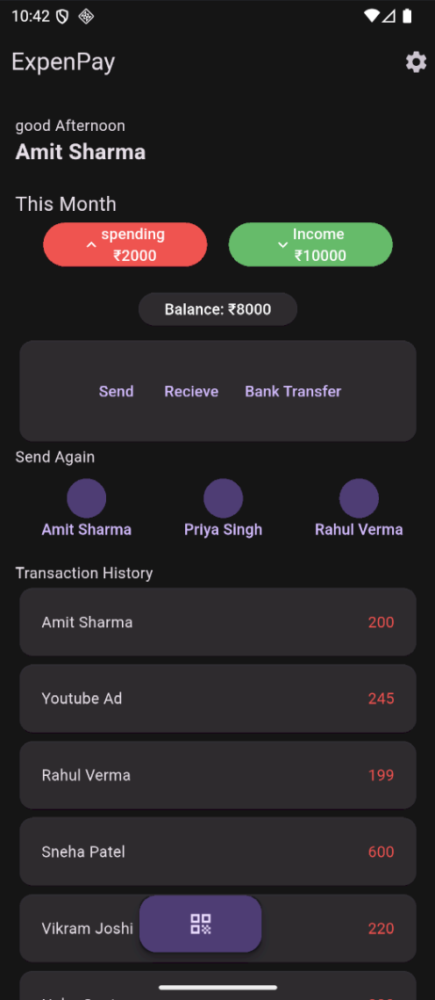

# Flutter Expense Tracker App

A Flutter app designed to help users track their expenses and view available payment systems. Currently, only the UI has been created, and the app is not fully functional yet.

## Screenshots

## Features (Planned)
- User-friendly interface to record expenses
- View expense history and summaries
- Integration with available payment systems (upcoming)
- Responsive design for mobile devices

## Current Status
- UI design completed
- Core app functionality and backend logic under development

